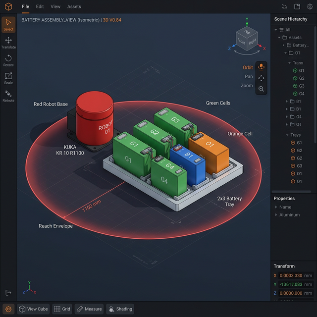
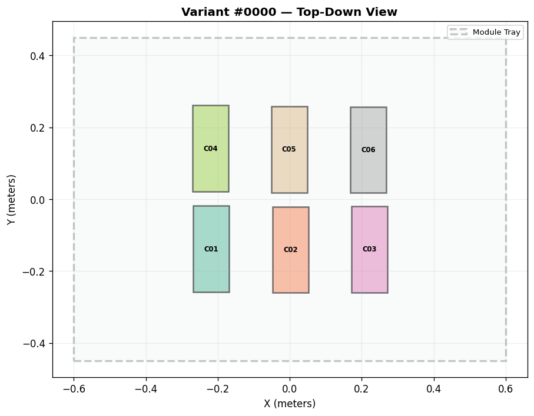
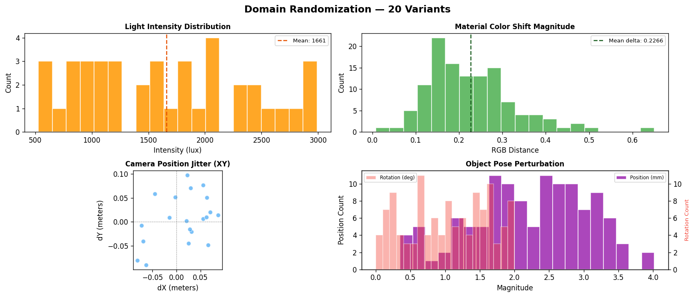
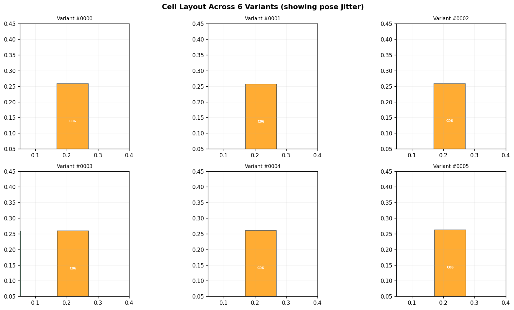
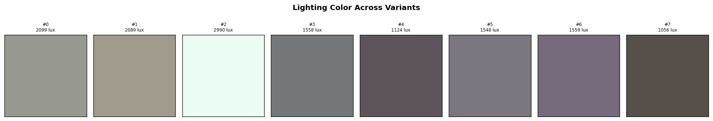

# 🏭 Industrial Synthetic Data Generation Lab

> **In one line:** Automatically generate diverse training data from a single 3D industrial scene (.usda) for AI vision models.

---

## What Does This Do?

Training AI for factory quality inspection (e.g., detecting misaligned battery cells) requires **thousands of labeled images**. Manual photography + annotation is too slow.

This tool's approach:

```
One 3D scene → automatically vary lighting/materials/camera/poses → N different annotated datasets
```


### Core Pipeline

| Step | What | Module |
|:---:|:---|:---|
| 1️⃣ | Load a USD scene (battery module) | `usd_writer.py` |
| 2️⃣ | Randomize 4 domains | `randomizer.py` |
| 3️⃣ | Export COCO-format annotations | `dataset_export.py` |
| 4️⃣ | Visualize & verify results | `preview.py` |

### 4 Domains of Randomization

| Domain | What Changes | Why |
|:---|:---|:---|
| 💡 **Lighting** | Intensity 500–3000 lux | Factory brightness varies by shift/weather |
| 🎨 **Materials** | Color shift ±8% | Batch-to-batch cell casing variation |
| 📷 **Camera** | Position ±10cm, FOV 50–75° | Sensor mounting tolerance |
| 🔩 **Object Pose** | Position ±3mm, rotation ±2° | Robot gripper placement accuracy |

---

## Demo Screenshots

### 🌟 Omniverse-Style 3D Viewport

The app includes an **Omniverse-style interactive 3D viewport** with PBR materials, bloom post-processing,
scene hierarchy panel, and property inspector. Cells are labeled G1–G4 / B1 / O1 with visible terminal connectors, bus bars, and tray dividers.



> Run `python app.py` → click **Generate & Export** → **🌟 Omniverse Viewport** tab

### 🗺️ Scene Layout — Top-Down View



### 📊 Randomization Distributions — Verify each domain varies



### 🔲 Multi-Variant Grid — Cell positions differ across variants



### 💡 Lighting Comparison — Color temperature and intensity



---

## Quick Start

```bash
pip install -r requirements.txt
python app.py
# Open http://localhost:7862
```

Click **🚀 Generate & Export** to run the full pipeline.

### Python API

```python
from schema import SDGConfig
from usd_writer import create_sample_battery_scene
from randomizer import generate_variants
from dataset_export import export_coco_dataset

scene = create_sample_battery_scene()
config = SDGConfig(scene_path=scene, num_variants=50, seed=42)
variants = generate_variants(config)
export_coco_dataset(variants, "outputs")  # → COCO annotations.json
```

---

## Part of the Industrial AI Toolchain

This project is the **downstream half** of a two-project toolchain:

```
spec-to-sim-copilot              industrial-sdg-lab
(Upstream: Scene Generation)     (Downstream: Data Generation)

Natural Language → LLM → Validate   USD Scene → Randomize
→ Self-Repair Loop → .usda    →→→   → COCO Annotations → AI Training
```

---

## Technical Decisions

| Decision | Rationale |
|:---|:---|
| **Pure-text USDA** instead of pxr SDK | pxr requires 500MB+ C++ build; regex suffices for attribute modification |
| **Domain Randomization** instead of photorealistic rendering | Cheaper, faster, equally effective (Tobin et al. 2017) |
| **COCO format** | Natively supported by YOLOv8 / Detectron2 / MMDetection |
| **GLB 3D preview** | Gradio's native Model3D component + trimesh for export |

## Limitations

- No actual rendering (would require Isaac Sim / Omniverse)
- Simplified pinhole projection, no lens distortion
- USDA text format only (.usd/.usdc not supported)

---

## Project Structure

```
├── app.py              — Gradio UI (port 7862)
├── schema.py           — Pydantic data models
├── config.py           — Parameter configuration
├── usd_writer.py       — Pure-text USDA parser/writer
├── randomizer.py       — Domain Randomization engine (4 domains)
├── dataset_export.py   — COCO annotation exporter
├── preview.py          — Distribution visualization
├── viewer_3d.py        — USDA → GLB scene converter
├── test_pipeline.py    — Integration tests (30 checks)
├── examples/           — Usage examples
├── sample_scenes/      — Example USD scenes
├── sample_outputs/     — Pre-generated COCO samples
└── assets/             — Demo screenshots
```

## License

MIT
