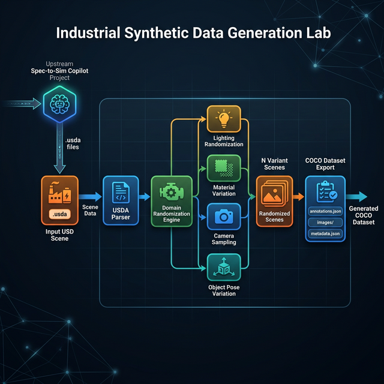

# 🏭 Industrial Synthetic Data Generation Lab

**Domain Randomization for Industrial AI Training Data**

Generate diverse synthetic datasets from USD scenes to train robust
computer vision models for manufacturing quality inspection.



**What it does:**
- **Load a USD scene** (battery module, assembly line, etc.)
- **Domain Randomization** — lighting, materials, camera, object pose
- **COCO dataset export** — ready for YOLOv8 / Detectron2 / MMDetection
- **Distribution visualization** — see exactly what was randomized

---

## Part of the Industrial AI Toolchain

```
┌──────────────────────────────┐     ┌──────────────────────────────┐
│   spec-to-sim-copilot        │     │    industrial-sdg-lab        │
│   ────────────────────       │     │    ──────────────────        │
│   「Upstream: Scene Build」   │ ──► │   「Downstream: Data Gen」   │
│                              │.usda│                              │
│  Prompt → LLM → Validator    │     │  USD → Domain Rand.          │
│  → Repair Loop → USD Scene   │     │  → Annotations → COCO        │
└──────────────────────────────┘     └──────────────────────────────┘
```

**spec-to-sim-copilot** generates validated USD scenes from natural language.  
**industrial-sdg-lab** takes those scenes and produces training data at scale.

---

## Architecture

```
Input .usda scene
    ↓
Pure-text USDA Parser (no pxr dependency)
    ↓
Domain Randomization Engine
    ├── 💡 Lighting (intensity, color temperature)
    ├── 🎨 Materials (hue shift, saturation, roughness)
    ├── 📷 Camera (position jitter, FOV variation)
    └── 🔩 Object Pose (position/rotation micro-perturbation)
    ↓
N randomized .usda variants (each with ground-truth metadata)
    ↓
COCO Dataset Exporter
    ├── 3D → 2D projection (pinhole camera model)
    ├── Bounding box computation
    └── annotations.json (COCO format)
```

### Randomization Parameters

| Domain | Parameter | Default Range | Why |
|:---|:---|:---|:---|
| **Lighting** | Intensity | 500–3000 lux | Factory lighting varies by shift, weather |
| **Lighting** | Color | Warm–Daylight | Different lamp types (LED, fluorescent) |
| **Materials** | Hue Shift | ±0.08 | Batch color variation in cell casings |
| **Materials** | Saturation | 0.7–1.3× | Surface wear and aging |
| **Camera** | Position | ±10cm | Sensor mounting tolerance |
| **Camera** | FOV | 50–75° | Different lens configurations |
| **Object Pose** | Position | ±3mm | Real placement inaccuracy |
| **Object Pose** | Rotation | ±2° | Gripper alignment tolerance |

---

## Quick Start

```bash
pip install -r requirements.txt

# Run the interactive UI
python app.py
```

Then open `http://localhost:7862` in your browser.

A sample battery module scene is created automatically on first run.

---

## CLI Usage

```python
from schema import SDGConfig
from usd_writer import create_sample_battery_scene
from randomizer import generate_variants
from dataset_export import export_coco_dataset

# Create sample scene
scene_path = create_sample_battery_scene()

# Configure
config = SDGConfig(
    scene_path=scene_path,
    num_variants=50,
    seed=42,
)

# Generate
variants = generate_variants(config)

# Export
export_coco_dataset(variants, "outputs")
# → outputs/annotations.json (COCO format)
```

---

## Technical Trade-offs (Builder's Notes)

### Why USD instead of JSON?
USD supports **Layering** — randomization results can be overlaid as sublayers
on the original scene without destroying source data. This is the same
architecture NVIDIA Omniverse uses for collaborative scene editing.

### Why pure-text USDA instead of pxr SDK?
The OpenUSD Python binding (`pxr`) requires a platform-specific build from
NVIDIA or Pixar, with 500MB+ of C++ dependencies. For domain randomization
(modifying attribute values), regex-based text manipulation on `.usda` files
is functionally equivalent and **zero-dependency**.

### Why Domain Randomization?
The **Sim-to-Real Gap** is the #1 failure mode when deploying vision models
trained on synthetic data. Domain Randomization forces the model to be
invariant to visual properties that vary in the real world (lighting, color,
viewpoint). This is cheaper and more scalable than photorealistic rendering.

Reference: Tobin et al., *"Domain Randomization for Transferring Deep Neural Networks from Simulation to the Real World"* (2017).

### Why COCO format?
It's the de facto standard. Every major detection framework supports it natively:
YOLOv8, Detectron2, MMDetection, TensorFlow Object Detection API.

### Why separate from spec-to-sim-copilot?
**Single Responsibility.** Scene generation (LLM + validation) is a fundamentally
different problem from data augmentation (randomization + annotation). Separating
them allows independent deployment, testing, and iteration.

---

## Project Structure

```
industrial-sdg-lab/
├── app.py              — Gradio UI (port 7862)
├── schema.py           — Pydantic models (SDGConfig, RandomizationStrategy)
├── config.py           — Parameter ranges and COCO category definitions
├── usd_writer.py       — Pure-text USDA parser/writer (no pxr dependency)
├── randomizer.py       — Domain Randomization engine (4 domains)
├── dataset_export.py   — COCO-format annotation exporter
├── preview.py          — Randomization distribution visualization
├── sample_scenes/      — Example USD scenes
├── assets/             — Architecture diagram
├── requirements.txt
└── .gitignore
```

---

## Limitations

- **No actual rendering** — generates scene variants + projected annotations,
  not rendered images (would require Isaac Sim / Omniverse)
- **Simplified projection** — pinhole camera, no lens distortion
- **USDA only** — binary `.usd` / `.usdc` formats not supported
- **No physics simulation** — object poses are perturbed randomly, not
  physically simulated
- **Single scene type** — optimized for battery module assembly scenes

These are deliberate scope boundaries. The point is to demonstrate the
**domain randomization → COCO pipeline pattern**, not to replace
NVIDIA Isaac Sim Replicator.

---

## License

MIT
